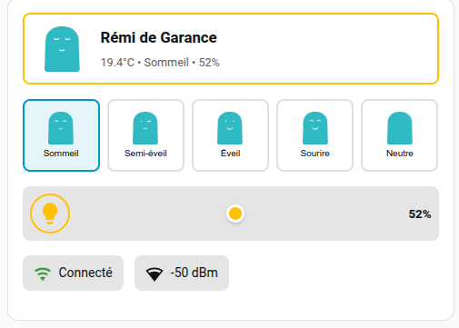

# Rémi Card

A custom Lovelace card for Home Assistant to display and control Rémi UrbanHello baby sleep trainer devices.

## Features

- 🎨 **Visual Face Display**: Shows current Rémi face state with images
- 😊 **Face Selector**: Interactive face selection (Sleep, Semi-awake, Awake, Smile, Neutral)
- 💡 **Brightness Slider**: Smooth brightness control with on/off toggle (0-100%)
- 🌡️ **Temperature Monitoring**: Current temperature with clickable graph access
- 📶 **Connectivity Status**: WiFi connection and signal strength
- 🖱️ **UI Editor Support**: Full visual configuration editor in Home Assistant
- ⚙️ **Configurable**: Show/hide sections as needed

## Installation

### HACS (Recommended)

1. Open HACS
2. Go to "Frontend"
3. Click the menu (three dots) in the top right
4. Select "Custom repositories"
5. Add this repository URL and select "Lovelace" as the category
6. Click "Install"
7. Refresh your browser

### Manual Installation

1. Copy `remi-card.js` to `<config>/www/community/remi-card/`
2. Add to your Lovelace resources:

```yaml
url: /local/community/remi-card/remi-card.js
type: module
```

## Adding to Dashboard

### Visual UI Editor (Recommended)

1. Go to your dashboard
2. Click the ⋮ menu → "Edit Dashboard"
3. Click "+ ADD CARD"
4. Scroll to "Custom" section and select **"Rémi Card"**
5. Fill in the configuration:
   - **Device ID**: `garance` (required)
   - **Device Name**: `Garance` (optional)
   - Toggle options as needed
6. Click "SAVE"

### YAML Configuration

Alternatively, you can configure the card in YAML:

## Configuration

### Basic Configuration

```yaml
type: custom:remi-card
device_id: garance
device_name: Garance
```

### Full Configuration

```yaml
type: custom:remi-card
device_id: garance
device_name: Garance
show_face_selector: true
show_controls: true
show_temperature_graph: true
show_connectivity: true
hours_to_show: 24
```

## Options

| Name | Type | Default | Description |
|------|------|---------|-------------|
| `type` | string | **Required** | `custom:remi-card` |
| `device_id` | string | **Required** | Device ID suffix (e.g., `garance` for entities like `light.remi_garance_night_light`) |
| `device_name` | string | `device_id` | Display name for the device |
| `show_face_selector` | boolean | `true` | Show face selection buttons (5 faces) |
| `show_controls` | boolean | `true` | Show light control buttons |
| `show_temperature_graph` | boolean | `true` | Show temperature section |
| `show_connectivity` | boolean | `true` | Show WiFi connectivity status |
| `hours_to_show` | number | `24` | Hours to show in temperature graph label |

## Required Entities

The card expects the following entities to exist (where `{device_id}` is your configured device ID):

- `sensor.remi_{device_id}_face` - Current face state (sensor)
- `select.remi_{device_id}_face` - Face selection control (for face selector)
- `light.remi_{device_id}_night_light` - Night light control
- `sensor.remi_{device_id}_temperature` - Temperature sensor
- `binary_sensor.remi_{device_id}_connectivity` - Connection status (optional)
- `sensor.remi_{device_id}_rssi` - WiFi signal strength (optional)

## Face Images

The card includes bundled face images in the `assets/` directory:
- `face_sleepy.png` - Sleeping face
- `face_awake.png` - Awake face
- `face_semi_awake.png` - Semi-awake face
- `face_smily.png` - Smiling face
- `face_blank.png` - Blank/neutral face

**Location:** `/local/community/remi-card/assets/`

The card automatically loads images from its own assets directory.

## Example Usage

### Single Device

```yaml
type: custom:remi-card
device_id: garance
```

 

### Compact View (Controls Only)

```yaml
type: custom:remi-card
device_id: garance
show_temperature_graph: false
show_connectivity: false
```

### Full View

```yaml
type: custom:remi-card
device_id: garance
device_name: Garance
show_controls: true
show_temperature_graph: true
show_connectivity: true
hours_to_show: 24
```

## Development

### Build

```bash
npm install
npm run build
```

### Watch Mode

```bash
npm run watch
```

### Lint

```bash
npm run lint
```

## License

MIT License
